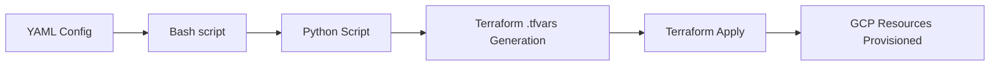

# Konecta Terraform Automation for GCP

<p align="center">   </p>

This repository is a Terraform automation tool for GCP infrastructure deployments using YAML and Python. Define your infrastructure in simple YAML then run the script for automation. By using YAML as the single source of truth, a team can define, deploy, and manage infrastructure with zero manual Terraform editing. 

## How it works

1. The user defines the project's details in a YAML file (e.g., project name, billing account, APIs, etc.)
2. The Python script then reads the YAML, and converts it into a valid `terraform.tfvars`, and runs normal Terraform commands
3. Terraform provisions the new infra, using these reusable modules

## Project Structure

```graph
gcp-autoproject/
├── main.tf # Root Terraform configuration
├── provider.tf # Provider and backend configuration
├── variables.tf # Root-level variable definitions
├── outputs.tf # Root-level Output definitions
├── modules/
│   ├── project/ # Create GCP project, billing, IAM, enable base APIs
│   ├── vpc/ # Networking backbone: custom VPC, subnets, firewall
│   ├── gcs/ # Basic storage buckets for state/files/assets
│   ├── compute/ # VM templates / instance groups for workloads
│   ├── cloudsql/ # Managed relational database
│   ├── cloudrun/ # Cloud Run services
│   ├── gke/ # Kubernetes cluster & node pools
│   ├── loadbalancer/ # HTTP/S LB fronting Compute or GKE
│   ├── pubsub/ # Messaging & eventing infrastructure
│   └── monitoring/ # Cloud Monitoring & Logging, alerts, dashboards
├── configs/
│   ├── example-project.yaml # Example input configuration
│   ├── example-vpc-gcs.yaml # Simple network and storage configuration
│   ├── example-webapp.yaml # Serverless webapp configuration
│   └── example-gke-nginx.yaml # Production ready GKE configuration
├── autogcp # Bash script wrapper on scripts/
├── scripts/
│	├── logs/ # Script execution logs
│   ├── deploy.py # Automation deployment script
│   └── destroy.py # Automation destruction script
├── backends/ # Dynamically created backend for each project_id
├── requirements.txt # Packages needed by the Python scripts
└── README.md
```

## Getting Started

### Prerequisites

- Python
- Terraform
- GCP Account with billing enabled
- gcloud cli

### Steps

1. Clone & Install

```bash
git clone https://github.com/gimmeursocks/konecta-terraform-automation.git
cd konecta-terraform-automation
pip install -r requirements.txt
```

2. Make script executable

```bash
chmod +x ./autogcp
```

3. Authenticate with GCP by either:

```bash
gcloud auth application-default login
# or by setting the environment variable
export GOOGLE_APPLICATION_CREDENTIALS=
```

4. Create a state bucket (First time only) in any project, with the name `konecta-autogcp-terraform-state-bucket` with versioning enabled

5. Deploy and destroy

```bash
./autogcp apply config.yaml --auto-approve
./autogcp plan config.yaml --quiet
./autogcp destroy config.yaml --workspace prod --target module.vpc
```

## Remote Backend

This automation is configured to dynamically load the backend from a remote state, either defined in YAML or as a prefix in the aforementioned bucket, which results in these files created in `backends/`:

```bash
# backends/konecta-autogcp-basic.backend.conf
bucket = "konecta-autogcp-terraform-state-bucket"
prefix = "projects/konecta-autogcp-basic"
```

which is then later used inside the script to load the correct `.tfstate` file for the right project:

```bash
# In scripts/deploy.py for configs/example-vpc-gcs.yaml
terraform init -reconfigure -backend-config=backends/konecta-autogcp-basic.backend.conf
```

## Usage

To automate the creation of a GCP project, feel free to build upon  `configs/example-project.yaml` using variables from `variables.tf`:

```yaml
project_id: "dev-intern-poc"
organization_id: "YOUR_ORG_ID"
billing_account: "XXXXXX-XXXXXX-XXXXXX"
labels:
  owner: intern
  environment: test
apis:
  - compute.googleapis.com
  - iam.googleapis.com
```

The python script `deploy.py` will then automatically:

- Initialize the backend remotely using `project/{project_id}` prefix in the bucket
- Generate tf variables from YAML
- Apply the configuration and create your GCP project

Then, if you wish to delete your infra, `destroy.py` will:

- Safely destroy your Terraform infrastructure
- Install multiple safety checks to guard the infrastructure

Both scripts provide:

- A bash script wrapper that is easily called:

```bash
./autogcp plan config.yaml
# instead of
python scripts/deploy.py config.yaml --dry-run
```

- Comprehensive logging with adjustable levels `--quiet`, `--verbose`, or normal info
- Effective catching of potential exceptions and errors
- Ensure idempotent behavior by using the remote backend
- Clear separation between different projects with separate YAMLs

## Configuration

#### Basic config

Every base file must have the following:

```yaml
project_id: "dev-intern-poc"
organization_id: "YOUR_ORG_ID"
billing_account: "XXXXXX-XXXXXX-XXXXXX"
```

#### Enabling APIs and modules

To enable APIs just add them here:

```yaml
# Enabled APIs
apis:
  - compute.googleapis.com
  - iam.googleapis.com
  ....
```

And to enable the modules, just set their boolean to true:

```yaml
# Feature Flags 
enable_vpc: true
enable_gcs: true
enable_monitoring: true
```

#### Labeling a project

To label a project:

```yaml
labels:
  environment: dev
  owner: intern
  project_type: "development"
```

#### Configuring the modules

To infer each module usage, you can refer to `variables.tf` to check what variables are optional:

```yaml
# VPC Config
network_name: "main-vpc"

subnets:
  primary-subnet:
    ip_cidr_range: "10.10.0.0/24"
    region: "europe-west10"

# GCS Config
buckets:
  konecta-basic-project-data:
    location: "US"
    storage_class: "STANDARD"
    versioning: true
    force_destroy: true
....
```

## Architecture Overview



Options:

```bash
- `-w, --workspace <name>` - Use Terraform workspace
- `-a, --auto-approve` - Skip confirmation prompts
- `-d, --dry-run` - Only plan the infrastructure
- `-v, --verbose` - Enable debug logging
- `-q, --quiet` - Only show warnings and errors
```

Extra option in `destroy.py`:

```bash
- `-t, --target` - Destroy specific resource (can be used multiple times)
```

## GitHub Actions Workflow

This repository has a CICD workflow that runs only when `.yaml` files are added or changed in the `configs` directory. This script should do the following:

- Triggered by changes in the `config` directory
- Authenticate GCP using `GOOGLE_APPLICATION_CREDENTIALS` secret
- Send deployment status to Slack

However, it does not functionally deploy the infrastructure, due to the current implementation making a new project separately which is not supported for a service account, unless you have an organization_id

### Slack Webhook

The CICD workflow sends a message to the webhook depending on the deployment status, this uses the `SLACK_WEBHOOK_URL` secret to send the status
